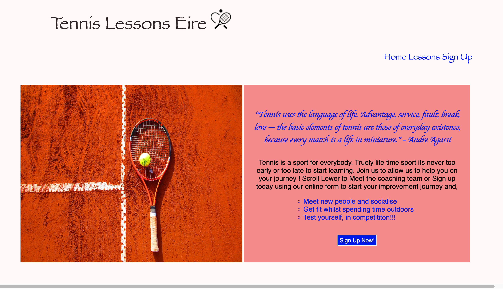

# Tennis Lessons Eire 

This tennis lesson website is a landing page for potential tennis lessons students who may want to avail of tennis lessons from qualified coaches in the north co. Dublin region. 

## Features

Home/Index page 

  

       1 - Stlyish Header with Tennis Font Syling image 
       2 - Large heading text given celtic text stlying to tie in with "Eire" Website Name
       3 - Inpriation quote and including welcome text to grab peoples attention and interest 
       4 - Immeadiate link to sign up page to get more clicks to sing up page as this is purpose of website 
       5 - Immeadiate introduction to the coachs in a bright and inviting dispaly.
       6 - Critical information displayed on main page aka the when and where of lessons
       7 - google maps location feature added to assist in customer understanding of location
       8 - footer with social media links that open new tab accross all pages 

Lessons Page 
 
       1 - Color scheme given to each section to tie in with the Eire website name 
       2 - Representative photos given to each section 
       3 - More detialed information of the option for coach 
       4 - Again multiple well place links to sign up page to get more clicks to sing up page as this is purpose of website 

Sign Up page 
 
       1 - Background image 
       2 - radio buttons to gather information about the possbile new cusotmer 
       3 - Text/email inputs with sign up button to gather possible new customer details 

## Deployment

        **SubHeading 1**
        **SubHeading 2**
        **SubHeading 3**

## Testing & Validation   

W3 Validation was carried out - 

Some major issues Found - Index Page 

Div inside Span  - To create inline blocks on my intro area I used Span functionality then to later stlye the content for this area I enclosed items in the intro area in Divs.

 Upon Running the W3 Code validator This was flagged up as 

"Error: Element "div" not allowed as child of element "span" in this context"

## Credits 

The following websites/orgs where extremely helpful in assiting with my understanding of what is requried and inspiration for what is the standard for this type of website.

Technical assitacne credits 

W3 School
W3 Code validator 
Stack Over flow 
Kevin Powell - Youtube Channel 

Inspitation Assistance credits and allocation of some images 

        alsaa tennis club - website 
        euroschooloftennis -  website 

Stock images 

      Pxhere.com 

## Other  

        **SubHeading 1**
        **SubHeading 2**
        **SubHeading 3**

